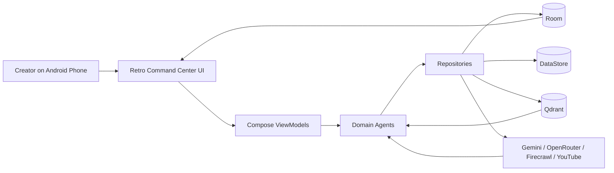
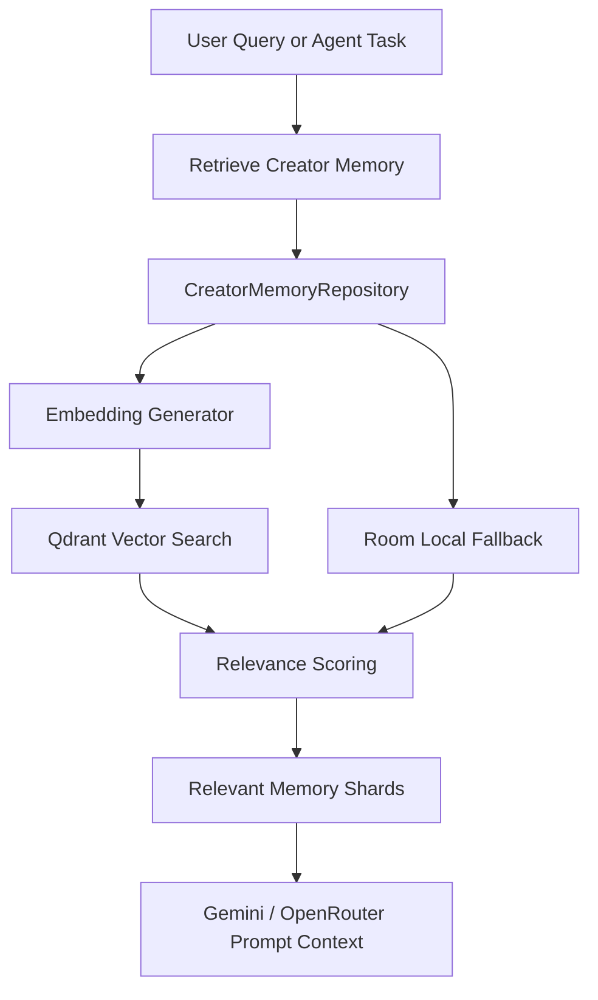
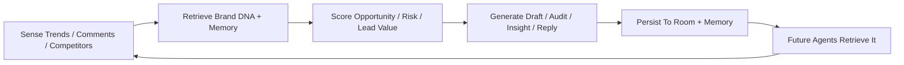

# BrandForge

**An Autonomous AI Social Media Engine — The Creator's Digital Twin**

BrandForge is a phone-first Android application that gives creators an always-on AI social media team. It learns the creator's Brand DNA, stores long-term memory, monitors trends, analyzes competitors, detects leads, audits PR risk, generates content and media, and answers strategic questions through a Digital Twin Chat.

This is not another caption generator. BrandForge is designed as an autonomous creator operating system.

## Problem

Creators, solopreneurs, coaches, startup founders, and small businesses are expected to act like full media teams. They need to:

- Track trends before they expire.
- Maintain a consistent brand voice across formats.
- Convert audience comments into business opportunities.
- Watch competitors without copying them.
- Avoid PR mistakes before posting.
- Produce content while managing their actual business.

Most tools solve only one slice: captions, scheduling, analytics, or chat. They do not remember the creator, do not connect trend discovery to brand voice, and do not close the loop from audience response back into future strategy.

## Solution

BrandForge turns the creator's Android phone into the source of truth for an AI social media team.

The app creates a persistent **Creator Digital Twin** that uses:

- **Brand DNA**: creator name, archetype, voice rules, banned claims, goals.
- **Creator Memory**: past content, trends, audience insights, leads, competitors, performance history.
- **Live Data**: Firecrawl search/scrape, YouTube Data API, profile URLs, competitor URLs.
- **AI Agents**: specialized workflows for trends, memory, content, leads, competitors, PR, and chat.
- **Local Persistence**: Room and DataStore keep the phone canonical.
- **Vector Retrieval**: Qdrant retrieves relevant memories for AI context.

The result is an app that does not just generate content. It learns, remembers, scores, explains, and prepares work.

## Implemented Features

### Brand DNA

- Manual Brand DNA onboarding.
- Profile URL ingestion using Firecrawl exact scrape plus search-backed scrape.
- Gemini-based profile extraction.
- Brand DNA persistence in Room.
- Brand DNA memory writing for future retrieval.

### Creator Memory

- Room-backed local memory shards.
- Qdrant remote vector memory.
- Embedding generation.
- Memory retrieval pipeline with local fallback.
- Memory types for Brand DNA, content, trends, leads, competitors, audience insights, and performance history.

### Trend Intelligence

- Firecrawl trend signals.
- YouTube trend signals.
- Source URL visibility.
- Exact source viewing from Trend Radar.
- Trend opportunity scoring using Brand DNA, creator goals, and retrieved memories.
- Ability to save trend opportunities into Creator Memory.

### Content Studio

- Generates:
  - Reel Script
  - Instagram Carousel
  - X Thread
- Prompt assembly using Brand DNA, creator goals, memory, trend opportunity, and competitor insights.
- Gemini/OpenRouter AI routing.
- Draft persistence in Room.
- Rendered media artifact system for images and videos.
- Full-screen in-app viewer for generated media.
- Failed media generation attempts are persisted with visible error details.

### Digital Twin Chat

- Chat with the creator's AI strategist.
- Answers with Brand DNA, goals, memory, trends, generated drafts, and competitor context.
- Persists conversations locally.
- Designed to feel like an autonomous creator strategist, not generic ChatGPT.

### Lead Detection

- Classifies comments or DM-like interactions as:
  - Lead
  - Question
  - Collaboration
  - Feedback
  - PR Risk
  - Ignore
- Uses Gemini Flash Lite style classification.
- Stores classification, confidence, priority, reason, and suggested reply locally.

### Competitor Intelligence

- Competitor URL onboarding.
- YouTube and Firecrawl data sources.
- Firecrawl exact URL scrape plus search-backed content discovery.
- Fetched content evidence panel.
- Gap analysis against Brand DNA, memory, goals, and existing trend opportunities.
- Competitor insights feed future trend opportunities, content generation, and Twin Chat.

### PR Risk Audit

- Upload image or video/document URI.
- Image uploads are sent to Gemini as multimodal input.
- Audits visual content, caption, Brand DNA, banned claims, memory, audience risk, and tone.
- Returns structured report with:
  - Overall risk
  - What is not working
  - Caption recommendation
  - Revised caption
  - Claims/tone risks
  - Audience risk
  - Final decision
  - Fixes before posting

### War Room

- OpenRouter-powered caption battle.
- Brand DNA Agent, Virality Agent, Competitor Agent, and Supervisor Agent debate a caption.
- Visual agent battle arena.
- Produces candidate captions, scoring, winner, and rationale.

### Voice Commands

- Android `SpeechRecognizer`.
- Routes spoken commands to workflows such as:
  - Generate content
  - Show trends
  - Analyze competitors
  - Detect leads
  - Audit PR risk
  - Prepare War Room

### Debugging And Device Testing

- Hidden debug panel via tapping the BrandForge logo 5 times.
- Health checks for Room, DataStore, OpenRouter, Gemini, Firecrawl, YouTube, Qdrant, memory, trends, content, chat, leads, and competitors.
- Debug seed actions.
- Global error logger.
- Real-device checklist.

### Visual System

- Retro cyber command-center UI.
- Near-black grid surface.
- White terminal borders.
- Yellow/cyan/green/red system accents.
- Monospace command feel.
- Animated Lottie BrandForge header logo.
- Custom BrandForge launcher icon.

## Why BrandForge Is Different

### Different From ChatGPT

ChatGPT waits for prompts. BrandForge maintains creator memory, retrieves brand context automatically, monitors signals, persists outputs, and coordinates specialized agents.

### Different From Jasper / Copy.ai

Most writing tools generate copy from a prompt. BrandForge starts from the creator's Digital Twin, scored trend opportunities, competitor gaps, and memory-backed goals.

### Different From Buffer / Hootsuite / Sprout Social

Scheduling and social management tools help publish and monitor. BrandForge focuses on autonomous strategy, memory, trend-jacking, content generation, PR risk, lead detection, and creator-specific reasoning.

## Architecture

BrandForge uses a production-shaped Android architecture:

- **Language**: Kotlin
- **UI**: Jetpack Compose
- **Architecture**: Clean Architecture, MVVM/MVI-style state, unidirectional data flow
- **Dependency Injection**: Hilt
- **Networking**: Retrofit + OkHttp
- **Storage**: Room + DataStore
- **Vector Memory**: Qdrant
- **AI Providers**: Gemini, OpenRouter
- **Data Sources**: Firecrawl, YouTube Data API
- **Voice**: Android SpeechRecognizer
- **Media**: Gemini image generation path, Veo video path, local artifact persistence

### High-Level Flow



### Memory Retrieval Flow



### Autonomous Agent Loop



## Package Structure

```text
app/src/main/java/com/brandforge/app/
  core/
    ai/              Gemini, OpenRouter, model APIs
    config/          environment and secrets access
    database/        Room entities, DAOs, migrations
    datastore/       creator preferences
    debug/           health checks, logs, seed actions
    di/              Hilt modules
    network/         Retrofit/OkHttp qualifiers
  data/
    content/         generated content and media repositories
    trend/           Firecrawl and YouTube trend sources
    memory/          Room/Qdrant memory implementation
    competitor/      competitor sources and repositories
    lead/            lead persistence
    twin/            chat persistence
  domain/
    agent/           workflow models
    content/         ContentAgent, media generation
    trend/           TrendAgent, scoring
    memory/          memory use cases and models
    competitor/      CompetitorAgent, GapAnalysisEngine
    lead/            LeadDetectionAgent
    twin/            TwinChatAgent, ContextAssembler
  presentation/
    commandcenter/
    memory/
    trend/
    content/
    twin/
    lead/
    competitor/
    pr/
    warroom/
    debug/
  ui/
    components/
    theme/
```

## Environment Setup

Create `.env` or `local.properties` with:

```properties
OPENROUTER_API_KEY=
GEMINI_API_KEY=
FIRECRAWL_API_KEY=
YOUTUBE_API_KEY=
QDRANT_URL=
QDRANT_API_KEY=
APIFY_API_TOKEN=
```

Endpoint defaults are already configured in Gradle:

```properties
OPENROUTER_BASE_URL=https://openrouter.ai/api/v1/
GEMINI_BASE_URL=https://generativelanguage.googleapis.com/
FIRECRAWL_BASE_URL=https://api.firecrawl.dev/
YOUTUBE_BASE_URL=https://www.googleapis.com/youtube/v3/
APIFY_BASE_URL=https://api.apify.com/v2/
```

Do not commit real API keys. `.env` is ignored.

## Build

```bash
JAVA_HOME=/Library/Java/JavaVirtualMachines/zulu-21.jdk/Contents/Home ./gradlew :app:assembleDebug --no-configuration-cache
```

Install on a connected Android device:

```bash
adb install -r BrandForge-debug.apk
```

## Demo Walkthrough

1. Open Brand DNA and save or scrape a creator profile URL.
2. Open Memory and retrieve creator-specific context.
3. Open Trend Radar, fetch trends, view a source URL, and add an opportunity to memory.
4. Open Content Studio and generate a Reel Script, Carousel, or X Thread.
5. Render an image/media artifact and view it full-screen.
6. Open PR Audit, upload an image, add a caption, and generate a risk/caption report.
7. Open Competitors, analyze a public URL, and inspect fetched content/gaps.
8. Open Twin Chat and ask what to post next.
9. Open War Room and run an agent caption battle.
10. Tap the logo 5 times to open the debug health panel.

## Hackathon Readiness

BrandForge is ready to demonstrate as a real Android APK with:

- Real persistence
- Real API clients
- Real AI routing
- Real memory retrieval
- Real trend and competitor source handling
- Real image-aware PR audit
- Real command-center UI
- Real device debug tooling

Known limitations:

- Publishing to social platforms is not implemented.
- Full overnight WorkManager automation is not the primary demo path.
- Video generation depends on provider model availability and may return remote URI or timeout.
- External CRM, WhatsApp, and social login integrations are intentionally excluded.

## Business Potential

BrandForge can begin as a mobile-first subscription tool for creators and solopreneurs, then expand into:

- Creator Pro subscription
- AI credit packs for generated media and agent runs
- Agency workspace for many creator twins
- Analytics and publishing integrations
- Brand collaboration and lead pipeline workflows

The long-term wedge is persistent creator intelligence, not commodity copy generation.

## Judge Deck

The judge-facing presentation is generated at:

```text
docs/BrandForge_Judges_Deck.pptx
```

## Final Line

**The creator sleeps. BrandForge works.**
