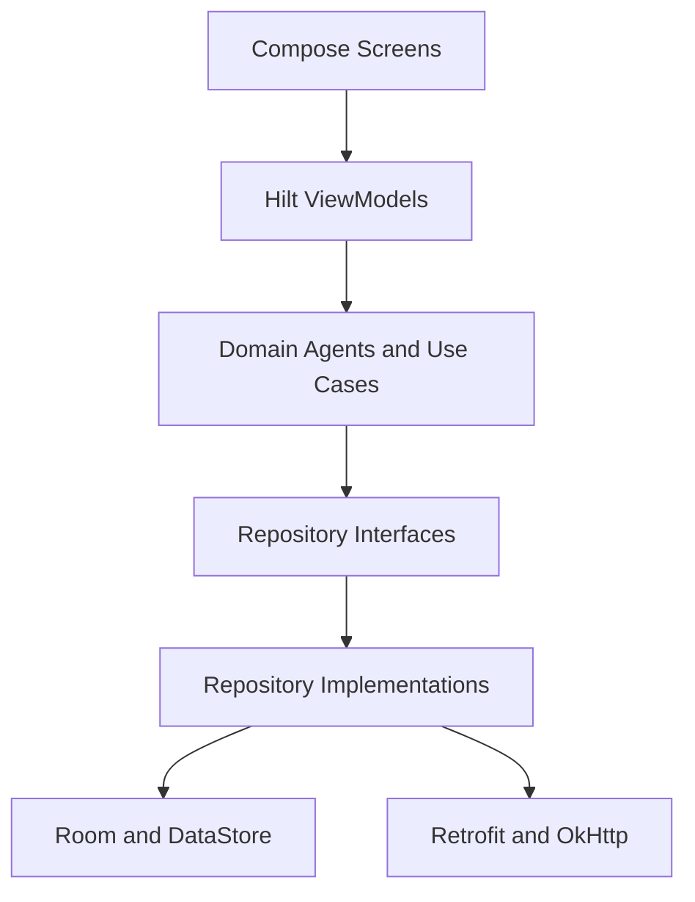
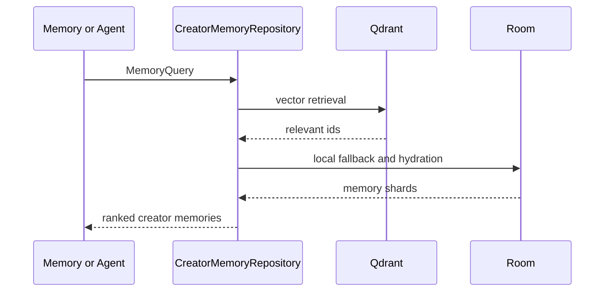
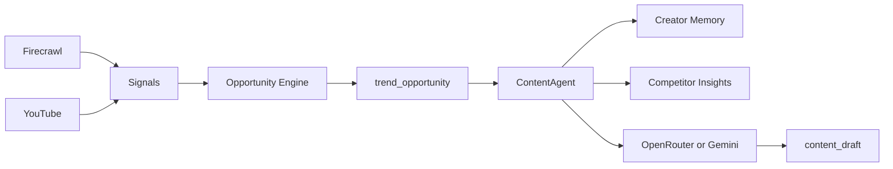
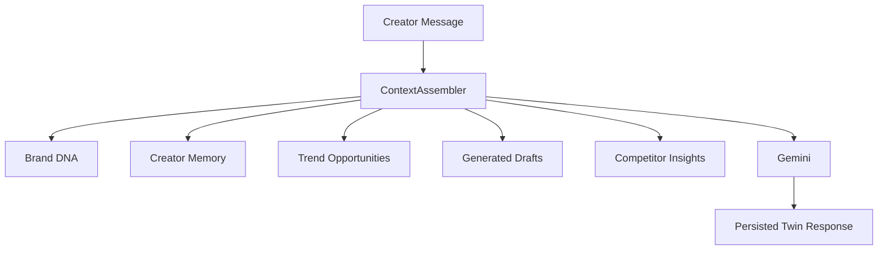
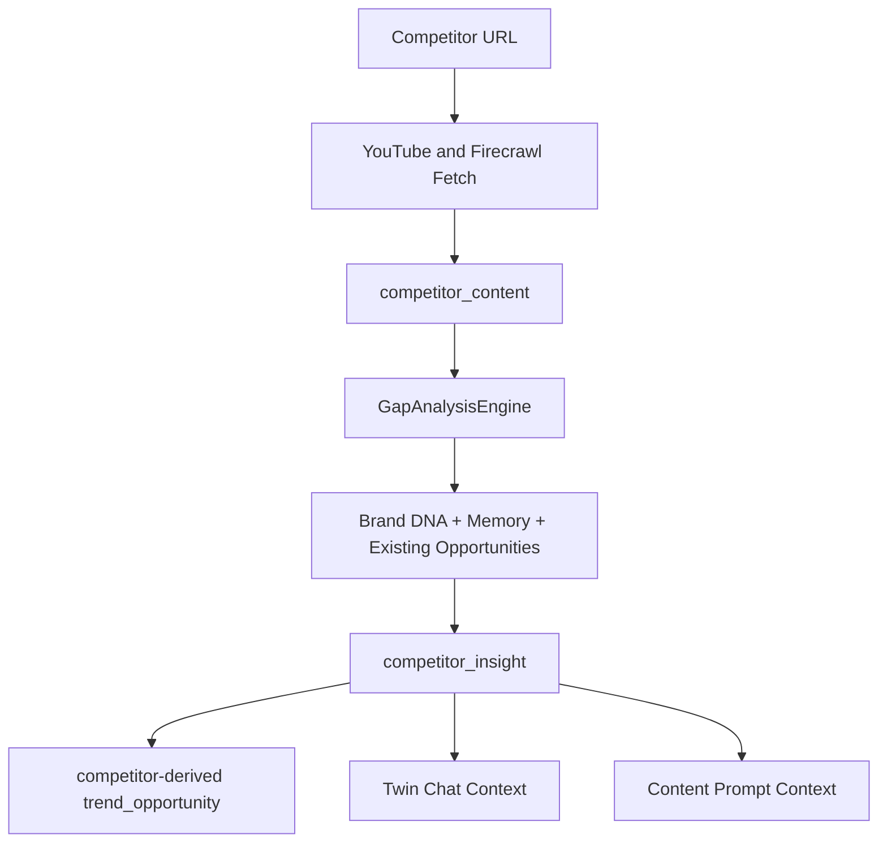

# Architecture Diagrams

## Android Layering

```mermaid
flowchart TB
    Screens["Compose Screens"] --> ViewModels["Hilt ViewModels"]
    ViewModels --> Domain["Domain Agents and Use Cases"]
    Domain --> Interfaces["Repository Interfaces"]
    Interfaces --> DataImpl["Repository Implementations"]
    DataImpl --> Local["Room and DataStore"]
    DataImpl --> Remote["Retrofit and OkHttp"]
```

## Creator Memory Retrieval

```mermaid
sequenceDiagram
    participant UI as Memory or Agent
    participant Repo as CreatorMemoryRepository
    participant Q as Qdrant
    participant R as Room
    UI->>Repo: MemoryQuery
    Repo->>Q: vector retrieval
    Q-->>Repo: relevant ids
    Repo->>R: local fallback and hydration
    R-->>Repo: memory shards
    Repo-->>UI: ranked creator memories
```

## Trend to Content

```mermaid
flowchart LR
    Firecrawl --> Signals
    YouTube --> Signals
    Signals --> Scoring["Opportunity Engine"]
    Scoring --> Room["trend_opportunity"]
    Room --> ContentAgent
    ContentAgent --> Memory["Creator Memory"]
    ContentAgent --> Competitors["Competitor Insights"]
    ContentAgent --> Models["OpenRouter or Gemini"]
    Models --> Drafts["content_draft"]
```

## Digital Twin Chat

```mermaid
flowchart TD
    User["Creator Message"] --> Context["ContextAssembler"]
    Context --> DNA["Brand DNA"]
    Context --> Memory["Creator Memory"]
    Context --> Trends["Trend Opportunities"]
    Context --> Drafts["Generated Drafts"]
    Context --> Competitors["Competitor Insights"]
    Context --> Gemini["Gemini"]
    Gemini --> Chat["Persisted Twin Response"]
```

## Competitor Intelligence

```mermaid
flowchart TD
    URL["Competitor URL"] --> Fetch["YouTube and Firecrawl Fetch"]
    Fetch --> Content["competitor_content"]
    Content --> Gap["GapAnalysisEngine"]
    Gap --> Compare["Brand DNA + Memory + Existing Opportunities"]
    Compare --> Insights["competitor_insight"]
    Insights --> Trends["competitor-derived trend_opportunity"]
    Insights --> Twin["Twin Chat Context"]
    Insights --> ContentAgent["Content Prompt Context"]
```

