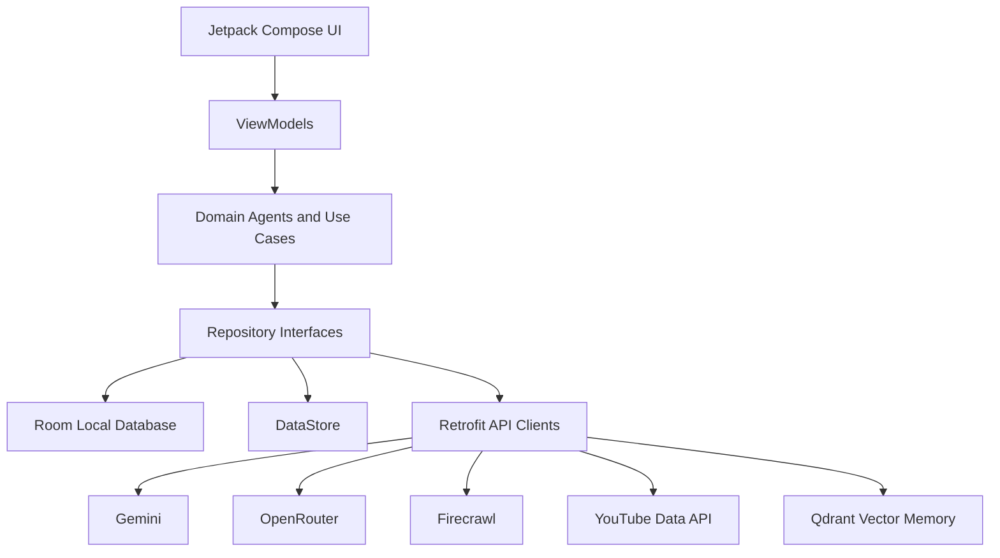

# BrandForge System Design

## System Shape

BrandForge is a modular Android application. The phone is the source of truth. Remote AI and data providers add intelligence, while Room and DataStore preserve local continuity.

## Primary Actors

- Creator: configures Brand DNA, asks the Twin, reviews content, and runs scans.
- AI agents: memory, trend, content, lead, competitor, and twin chat agents.
- External providers: Gemini, OpenRouter, Firecrawl, YouTube Data API, and Qdrant.

## Component Flow

## Data Model

Core Room tables:

- `brand_dna`
- `memory_shard`
- `content_sample`
- `trend_signal`
- `trend_opportunity`
- `content_draft`
- `twin_chat_message`
- `lead_detection`
- `competitor`
- `competitor_content`
- `competitor_insight`
- `foundation_audit`

## Agent Boundaries

- Memory Agent: local memory writes, Qdrant sync, retrieval.
- Trend Agent: fetch, normalize, score, persist opportunities.
- Content Agent: assemble memory-aware prompts and persist drafts.
- Lead Detection Agent: classify interactions with Gemini Flash Lite and persist results.
- Competitor Agent: fetch competitor content, generate gaps, persist insights, publish trend opportunities.
- Twin Chat Agent: assemble creator context and answer as an autonomous strategist.

## Failure Handling

- Missing environment keys are recorded in `foundation_audit`.
- Remote trend and competitor fetches are best-effort per data source.
- AI parsing failures fail visibly instead of silently inventing results.
- Local persistence is the durable source for generated intelligence.

